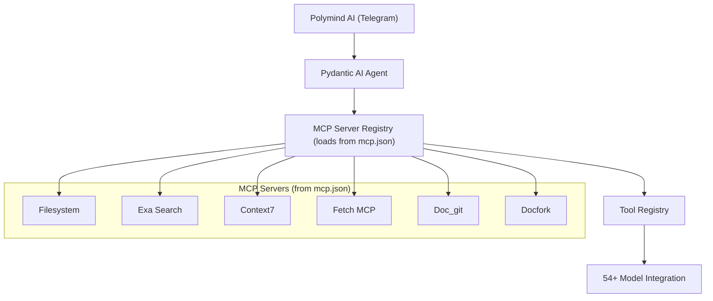

# Polymind AI: Pydantic AI + Smithery Exa Search Integration Workflow

## Overview
This guide describes how to integrate Pydantic AI agents with Exa Search and other MCP servers using smithery.ai in the Polymind AI project.

Your multi-modal Telegram bot will gain modular access to advanced conversational and search capabilities. The architecture supports:

- **Multi-modal Telegram interface**: Handles text, images, documents, and voice.
- **Pydantic AI Agent**: Orchestrates requests and manages context, using [Pydantic AI's agent framework](https://ai.pydantic.dev/agents/) for type-safe, structured, and extensible orchestration.
- **MCP Server Registry**: Dynamically loads multiple MCP servers from `mcp.json` (e.g., Exa Search, Filesystem, Context7, Doc_git, Docfork), each providing specialized tools. The agent does not build these servers itself—it calls and uses the pre-configured servers listed in `mcp.json`.
- **Tool Registry**: Aggregates tools from all MCP servers for agent use, leveraging [Pydantic AI's tool system](https://ai.pydantic.dev/tools/) for dynamic invocation and validation.
- **Hierarchical Model Integration**: Selects from 54+ AI models, combining model outputs with tool results for comprehensive responses.

This modular design allows adding or removing servers and tools via `mcp.json` configuration, enabling scalable and collaborative AI workflows without custom server implementation.

## Pydantic AI Agent Workflow

Pydantic AI agents provide a unified, Pythonic interface for orchestrating LLMs and tools:

- **Agent Composition**: Agents are instantiated with a model, system prompt, and optional output schema. You can register tools and dynamic system prompts using decorators.
- **Dependency Injection**: Pass dependencies (e.g., database connections, context objects) to agent runs for flexible, testable logic ([see docs](https://ai.pydantic.dev/dependencies/)).
- **Structured Output**: `src/handlers/response_formatter.py`.
- **Tool Invocation**: Register Python functions as tools; the agent will call them as needed, passing validated arguments and dependencies.
- **Streaming & Monitoring**: Agents support streaming responses and can be instrumented with [Logfire](https://ai.pydantic.dev/logfire/) for real-time monitoring.

Example agent setup:
```python
from pydantic_ai import Agent

agent = Agent(
    'google-gla:gemini-1.5-flash',
    system_prompt='Be concise, reply with one sentence.',
)
result = agent.run_sync('Where does "hello world" come from?')
print(result.output)
```

## Existing Polymind Architecture

Your codebase is organized as follows:
```
src/
├── api/              # FastAPI application setup and routes
├── bot/              # Telegram bot implementation
├── database/         # Database connection and schemas
├── handlers/         # Message, command, and callback handlers
├── services/         # AI model wrappers, business logic, and core services
├── utils/            # Utility functions, config, logging
```
Key features:
- 54+ AI models with hierarchical selection (`src/services/model_handlers/model_configs.py`)
- Multi-modal processing (text, image, document, voice)
- Telegram bot with group collaboration (`src/bot/telegram_bot.py`)
- Document analysis
- MongoDB persistence
- FastAPI/Uvicorn server

## Prerequisites

### Dependencies
Add these to your requirements:
```bash
uv add pydantic-ai
uv add "mcp[cli]"
```
Existing dependencies already include FastAPI, Uvicorn, MongoDB, and asyncio.

### Environment Setup
Add to `.env`:
```bash
SMITHERY_API_KEY=your_smithery_api_key_here
EXA_PROFILE=your_exa_profile_here
TELEGRAM_BOT_TOKEN=your_telegram_token
MONGODB_URI=your_mongodb_uri
GEMINI_API_KEY=your_gemini_api_key
```

## Integration Architecture



- The MCP Server Registry loads all MCP servers from `mcp.json`.
- 54+ AI models are selected hierarchically in `src/services/model_handlers/model_configs.py`.
- Each server provides specialized tools (e.g., search, filesystem access).
- The agent orchestrates these tools for multi-modal and collaborative tasks.
- Servers and tools can be added or removed via `mcp.json` configuration—no code changes or custom building required; the agent simply calls the provided servers.

**Current MCP Servers and Tools (from `mcp.json`):**

| Server Name         | Type            | Tools (examples)                                                                 | Description                                      |
|---------------------|-----------------|----------------------------------------------------------------------------------|--------------------------------------------------|
| exa-search          | stdio           | exa_search_company_research_exa, exa_search_web_search_exa, ...                  | Exa AI Search via Smithery.ai                    |
| fetch-mcp           | stdio           | *(not listed)*                                                                   | Web content fetching via Smithery.ai              |
| doc-git             | streamable_http | *(not listed)*                                                                   | Git repo documentation (disabled)                 |
| context7            | stdio           | *(not listed)*                                                                   | Context7 library docs                             |
| docfork             | stdio           | *(not listed)*                                                                   | Document analysis via Docfork/Smithery.ai         |
| duckduckgo-search   | stdio           | *(not listed)*                                                                   | DuckDuckGo web search                             |
| sequential-thinking | stdio           | *(not listed)*                                                                   | Sequential thinking/problem-solving tools         |

Tools are dynamically loaded and can be extended via `mcp.json`.

## Multi-MCP Server Registry

To flexibly integrate multiple MCP servers (e.g., Exa Searches, third-party APIs) from `mcp.json`, implement a modular registry in `src/services/mcp_registry.py`:

- Dynamically load and configure MCP servers from `mcp.json` without building them.
- Enable hot-swapping of servers without restarting the bot.
- Support server-specific tools (e.g., search, crawl) by calling the pre-configured servers.

Example:
```python
# src/services/mcp_registry.py
from typing import Dict, Any
import mcp

class MCPRegistry:
    def __init__(self, config_file: str = 'mcp.json'):
        self.servers: Dict[str, mcp.Server] = {}
        self.load_from_config(config_file)

    def load_from_config(self, config_file: str):
        # Load MCP servers from mcp.json without building them
        config = load_json(config_file)  # Assume a function to load JSON
        for name, server_config in config.items():
            self.servers[name] = mcp.Server(**server_config)  # Call pre-configured server

    def get_tools(self, server_name: str):
        return self.servers[server_name].tools if server_name in self.servers else []
```

## Agent Enhancement

Update your agent to leverage Pydantic AI's features:

- Register MCP tools as agent tools using decorators or dynamic registration.
- Use output schemas for structured responses.
- Inject dependencies for context-aware tool execution.

Example:
```python
# src/services/agent.py
from pydantic_ai import Agent
from .mcp_registry import MCPRegistry

class EnhancedAgent:
    def __init__(self, registry: MCPRegistry):
        self.registry = registry
        self.agent = Agent(
            'google-gla:gemini-1.5-flash',
            system_prompt='You are a multi-modal assistant.',
            # output_type=YourOutputModel,  # Optional: enforce structured output
        )
        self.add_mcp_tools(list(self.registry.servers.keys()))

    def add_mcp_tools(self, server_names: list[str]):
        for name in server_names:
            tools = self.registry.get_tools(name)
            for tool in tools:
                self.agent.tool(tool)  # Register tool with agent

    async def run(self, query, deps=None):
        return await self.agent.run(query, deps=deps)
```

## Telegram Handler Integration

Connect the enhanced agent and MCP registry in your Telegram bot handler (`src/handlers/telegram_handler.py`) to enable new commands and tool access.

## Telegram Commands

Implement commands for search, company research, crawling, and direct MCP queries in your handler:

| Command                | Description                      | Example                                 |
|------------------------|----------------------------------|-----------------------------------------|
| `/search <query>`      | Web search via Exa AI (calls Exa Search MCP tool) | `/search What is the current time in Phnom Penh?`   |
| `/company <name>`      | Company research (calls Exa Company Research tool) | `/company Tesla`                        |
| `/crawl <url>`         | Extract content from URL (calls Exa Crawl tool)    | `/crawl https://example.com/article`    |
| `/Context7 <query>`    | Library/documentation search (calls Context7 MCP tool) | `/Context7 How to use FastAPI middleware?` |

**Note:**  
When you use commands like `/search`, `/Context7`, `/company`, or `/crawl`, the AI Agent automatically invokes the corresponding MCP tool from the registry (e.g., Exa Search, Context7, DuckDuckGo, etc.) and integrates the results with model outputs. No manual tool selection is required—the agent handles tool invocation and response composition.

For example:
- `/search <query>` → Calls Exa Search MCP tool.
- `/Context7 <query>` → Calls Context7 documentation tool.
- `/company <name>` → Calls Exa Company Research tool.

You can add or remove available tools by updating `mcp.json`; the agent will dynamically use the configured tools for each command.

## MCP Server Integration with Pydantic AI

Pydantic AI provides a unified interface for interacting with MCP servers and their tools. MCP servers are external processes or HTTP endpoints that expose toolsets for the agent to use. The agent can dynamically discover, invoke, and validate tools from these servers.

- **Configuration**: MCP servers are defined in `mcp.json` (see [API reference](https://ai.pydantic.dev/api/mcp/)), specifying type (`stdio` or `streamable_http`), command/args, enabled status, and available tools.
- **Discovery**: The MCP registry loads all enabled servers and their tools at startup, making them available for agent orchestration.
- **Invocation**: When a user issues a command (e.g., `/search`), the agent selects the appropriate MCP tool and invokes it, passing validated arguments and context.
- **Tool Schema**: Each tool exposes a schema (validated by Pydantic) for its arguments and output, ensuring type safety and structured responses.
- **Extensibility**: Add or remove MCP servers and tools by editing `mcp.json`—no code changes required.

Example MCP server config (`mcp.json`):
```jsonc
{
  "exa-search": {
    "type": "stdio",
    "command": "npx",
    "args": [
      "-y",
      "@smithery/cli@latest",
      "run",
      "exa",
      "--key",
      "${SMITHERY_API_KEY}"
    ],
    "tools": [
      "exa_search_company_research_exa",
      "exa_search_crawling_exa",
      "exa_search_web_search_exa"
    ],
    "description": "Exa AI Search via Smithery.ai"
  },
  ...existing code...
}
```

See [Pydantic AI MCP API](https://ai.pydantic.dev/api/mcp/) for details on server orchestration, tool schemas, and advanced usage.

## Pydantic AI Features in Polymind

- **Type Safety**: All agent inputs/outputs and tool arguments are type-checked.
- **Structured Responses**: Use Pydantic models to validate and constrain outputs.
- **Dynamic Tool Invocation**: The agent automatically selects and calls tools based on user queries and context.
- **Streaming**: Optionally stream responses for real-time feedback.
- **Dependency Injection**: Pass context, user/session info, or external connections to agent runs and tools.
- **Monitoring**: Integrate [Logfire](https://ai.pydantic.dev/logfire/) for debugging and performance tracking.

## Production Considerations

- **Rate Limiting**: Prevent excessive search requests (e.g., 5 requests per day & max_retire = 5).
- **Error Handling**: Provide graceful fallbacks if services are down.
- **Monitoring**: Log usage and performance.
- **Security**: Sanitize all inputs.
- **Scalability**: Add/remove servers via config; monitor resource usage.

## Next Steps

1. Implement MCP server and agent classes in `src/services/mcp_registry.py` and `src/services/agent.py`.
2. Test integration with model selection (`src/services/model_handlers/model_configs.py`).
3. Add new Telegram commands in `src/handlers/telegram_handler.py`.
4. Update documentation/help.
5. Deploy and monitor.

## User Benefits

- **Real-time Info**: Access current web data alongside AI responses.
- **Company Research**: Get business intelligence instantly.
- **Enhanced Analysis**: Combine document analysis with market context.
- **Group Research**: Collaborate in group chats.
- **Source Citation**: Provide verifiable, attributed information.
- **Extensibility**: Easily add custom MCP servers/tools via `mcp.json`.

This integration preserves your existing architecture while adding powerful search and research capabilities to enhance your multi-modal AI features.

---

**References:**
- [Pydantic AI Documentation](https://ai.pydantic.dev/)
- [Tools & Dependency Injection Example](https://ai.pydantic.dev/#tools-dependency-injection-example)
- [Structured Output](https://ai.pydantic.dev/output/)
- [Agent API Reference](https://ai.pydantic.dev/api/agent/)