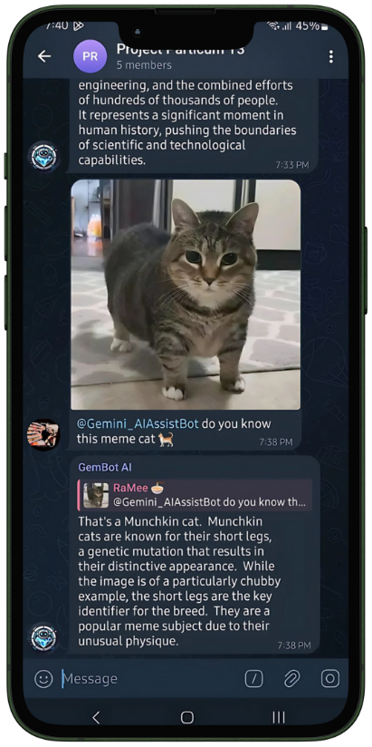

# Telegram Gemini Bot

A sophisticated Telegram bot powered by Google's Gemini AI, offering advanced image processing, text analysis, PDF handling, voice message transcription, and multilingual support.<div align="center">
  
</div>
## 🚀 Features

- **🤖 AI-Powered Conversations**
  - Engage in intelligent, context-aware conversations using Google's Gemini AI.
  - Receive meaningful and dynamic responses tailored to your queries and interactions.

- **🖼️ Image Analysis & Generation**
  - **Image Analysis:** Upload images for detailed analysis, including object recognition, scene description, and more.
  - **Image Generation:** Create new images from text descriptions, enabling creative content generation directly within Telegram.

- **📄 PDF Document Processing**
  - **Upload & Analyze:** Easily upload PDF documents for text extraction, summarization, and content analysis.
  - **Search & Query:** Perform keyword searches and retrieve specific information from your PDFs seamlessly.

- **🎤 Voice Message Transcription**
  - **Speech-to-Text:** Send voice messages and receive transcribed text, facilitating hands-free communication.
  - **Language Detection:** Automatically detect the language of the voice message for accurate transcription.

- **🌍 Multilingual Support**
  - Communicate in over 50 languages, making the bot accessible to a global audience.
  - **Automatic Translation:** Translate messages between different languages in real-time.

- **🔄 Rate Limiting & Caching**
  - **Rate Limiting:** Prevent abuse and manage API usage efficiently with configurable rate limits.
  - **Caching Mechanisms:** Enhance performance and reduce latency by caching frequent requests and responses.

- **⚡ Fast Response Times**
  - Optimized for quick interactions, ensuring minimal wait times for users.
  - Leverages asynchronous programming and efficient resource management for scalability.

- **📊 User Statistics Tracking**
  - Monitor and analyze user interactions, including message counts, active sessions, and feature usage.
  - **Dashboard Integration:** Visualize statistics through integrated dashboards for better insights.

- **💾 MongoDB Integration**
  - Robust and scalable database integration for efficient data management.
  - **Secure Storage:** Safeguard user data with encrypted storage and regular backups.

- **🛡️ Secure File Handling**
  - Manage file uploads securely to prevent vulnerabilities and ensure user privacy.
  - **File Validation:** Automatically validate file types and sizes before processing.

- **🔧 Customizable Settings**
  - Allow users to personalize their experience with configurable settings for language, notification preferences, and more.
  - **User Profiles:** Maintain individual user profiles to remember preferences and past interactions.

## 📦 Installation

Follow these steps to set up the Telegram Gemini Bot on your local machine or server.

### 1. Clone the Repository

```bash
git clone https://github.com/Remy2404/Telegram-Gemini-Bot.git
cd Telegram-Gemini-Bot
code .
``` 

### 2. Install Dependencies

Ensure you have Python 3.11 installed. Then, install the required Python packages:

```bash
pip install -r requirements.txt
```

### 3. Configure Environment Variables

Create a 

.env

 file in the root directory with the following content:

```env
DATABASE_URL=your_mongodb_url
TELEGRAM_BOT_TOKEN=your_telegram_bot_token
GEMINI_API_KEY=your_gemini_api_key
WEBHOOK_URL=your_webhook_url
TEXT_TO_IMAGE_API_KEY=your_huggingface_api_key
```

**Explanation of Environment Variables:**

- `DATABASE_URL`: MongoDB connection string.
- `TELEGRAM_BOT_TOKEN`: Token for your Telegram bot.
- `GEMINI_API_KEY`: API key for Google's Gemini AI.
- `WEBHOOK_URL`: Public URL where Telegram will send updates (e.g., using ngrok for local development).
- `TEXT_TO_IMAGE_API_KEY`: API key for Hugging Face's text-to-image services.

### 4. Start the Bot

Run the following command to launch the bot:

```bash
python src/app.py
<<<<<<< HEAD
=======
```
<span style="color: red;">For production you can start the bot </span>
```bash
 cd src && uvicorn main:app --host 0.0.0.0 --port 8000
>>>>>>> b301a9f6608cf179845ae65186eb7bd2e915af9e
```
## 🛠️ Bot Commands

Interact with the bot using the following commands:

- `/start` - Initialize the bot and receive a welcome message.
- `/help` - Display available commands and usage instructions.
- `/settings` - Configure bot settings such as language and notification preferences.
- `/reset` - Reset conversation history and preferences.
- `/generate_image` - Generate images from text descriptions.
- `/language` - Change the bot's interface language.
- `/stats` - View your usage statistics and interaction history.
- `/export` - Export your conversation history in a preferred format.

## 🏗️ Architecture

The project's architecture is designed for scalability, maintainability, and efficient resource management.

```
src/
├── handlers/         # Message and command handlers
├── services/         # Core services (Gemini API, rate limiting, etc.)
├── utils/            # Utility functions and helpers
├── database/         # Database models and connections
└── main.py           # Application entry point
```

### Key Components

- **GeminiAPI:** Manages interactions with Google's Gemini AI, handling requests and responses for AI-powered features.
- **UserDataManager:** Handles user data, including conversation histories, preferences, and statistics.
- **PDFHandler:** Processes and analyzes PDF documents, enabling text extraction and summarization.
- **LanguageManager:** Provides multilingual support, including automatic translation and language detection.
- **RateLimiter:** Controls the rate of incoming requests to prevent abuse and manage API usage effectively.
- **ImageProcessor:** Analyzes and generates images based on user inputs, leveraging AI for creative content creation.
- **VoiceHandler:** Transcribes voice messages into text, facilitating voice-to-text communication.
- **ErrorHandler:** Implements comprehensive error handling and logging mechanisms to ensure smooth operation.

## 🔑 Key Components

- **GeminiAPI:** Handles interactions with Google's Gemini AI, including content generation and analysis.
- **UserDataManager:** Manages user data, including conversation histories, preferences, and usage statistics.
- **PDFHandler:** Processes PDF documents, enabling text extraction, summarization, and content analysis.
- **LanguageManager:** Provides multilingual support, including translation and language detection.
- **RateLimiter:** Controls the rate of incoming requests to prevent abuse and manage API usage efficiently.
- **ImageProcessor:** Analyzes and generates images based on user input, leveraging AI for creative content creation.
- **VoiceHandler:** Transcribes voice messages into text, facilitating voice-to-text communication.
- **ErrorHandler:** Implements comprehensive error handling and logging mechanisms to ensure smooth operation.

## 🧪 Development

### Requirements

- **Python:** 3.11+
- **MongoDB:** For database management and storage.
- **Google Gemini API Access:** For AI-powered features.
- **Telegram Bot Token:** To integrate the bot with Telegram.
- **Hugging Face API Token:** For text-to-image generation services.

### Setting Up the Development Environment

1. **Clone the Repository:**

    ```bash
    git clone https://github.com/Remy2404/Telegram-Gemini-Bot.git
    cd Telegram-Gemini-Bot
    ```

2. **Create a Virtual Environment:**

    ```bash
    python -m venv .venv
    .venv\Scripts\activate  # On Windows
    source .venv/bin/activate  # On Unix or MacOS
    ```

3. **Install Dependencies:**

    ```bash
    pip install -r requirements.txt
    ```

4. **Configure Environment Variables:**

    Create a 
.env

 file as described in the Installation section.

### Running Tests

Execute unit tests using:

```bash
pytest tests/
```

Ensure that all tests pass to maintain code quality and reliability.

## 🐳 Docker Support

Containerize and deploy the bot using Docker for consistent environments and easy scalability.

### 1. Build the Docker Image

```bash
docker build -t telegram-gemini-bot .
```

### 2. Run the Docker Container

```bash
docker run -d -p 8000:8000 --env-file .env telegram-gemini-bot
```

### 3. Docker Compose (Optional)

For managing multi-container setups or additional services, use Docker Compose.

```yaml
# docker-compose.yaml
version: '3.8'

services:
  bot:
    build: .
    ports:
      - "8000:8000"
    env_file:
      - .env
    restart: unless-stopped
```

Run with:

```bash
docker-compose up -d
```

## ⚙️ Deployment

Deploy the bot using one of the following methods:

1. **Render:** Utilize the provided 

render.yaml

 for streamlined deployment on [Render](https://render.com/).
2. **Docker Containers:** Deploy using Docker for isolation and scalability on platforms like AWS, Azure, or DigitalOcean.
3. **Traditional Python Hosting:** Host on platforms that support Python applications, such as Heroku or Google Cloud Platform.
4. **koyeb.com:** support for popular languages and Docker containers, without any modification.

### Setting Up Webhooks

1. **Expose Your Local Server:**

    If running locally, use tools like [ngrok](https://ngrok.com/) to expose your server to the internet.

    ```bash
    ngrok http 8000
    ```

2. **Configure Webhook URL:**

    Ensure the `WEBHOOK_URL` in your .env

 file is set to the public URL provided by ngrok or your deployed server.

3. **Set Webhook:**

    The bot will automatically set the webhook on startup using the provided `WEBHOOK_URL`.

## 🛡️ Security

The bot adheres to best security practices to ensure user data protection and system integrity.

- **Rate Limiting:** Prevents abuse by limiting the number of requests a user can make within a specific timeframe.
- **Input Validation & Sanitization:** Ensures all user inputs are validated and sanitized to prevent injection attacks and other vulnerabilities.
- **Secure File Handling:** Manages file uploads securely, validating file types and sizes to prevent malicious uploads.
- **Environment Variable Protection:** Keeps sensitive information like API keys and tokens out of the codebase through the use of environment variables.
- **Encrypted Data Storage:** Utilizes encrypted connections for database interactions and data storage to protect user information.

## 🤝 Contributing

Contributions are welcome! Follow these steps to contribute to the project:

1. **Fork the Repository**

    Navigate to the [GitHub repository](https://github.com/Remy2404/Telegram-Gemini-Bot) and click the "Fork" button.

2. **Clone Your Fork**

    ```bash
    git clone https://github.com/YourUsername/Telegram-Gemini-Bot.git
    cd Telegram-Gemini-Bot
    ```

3. **Create a Feature Branch**

    ```bash
    git checkout -b feature/YourFeature
    ```

4. **Commit Your Changes**

    ```bash
    git commit -m "Add Your Feature"
    ```

5. **Push to the Branch**

    ```bash
    git push origin feature/YourFeature
    ```

6. **Create a Pull Request**

    Go to your forked repository on GitHub and click "Compare & Pull Request."

## 🔒 License

This project is licensed under the MIT License. See the 

LICENSE

 file for details.

## 🙌 Credits

- [python-telegram-bot](https://github.com/python-telegram-bot/python-telegram-bot) - Python library for Telegram Bot API.
- [Google Generative AI](https://ai.google.dev/) - Powering the AI capabilities of the bot.
- [MongoDB](https://www.mongodb.com/) - Database solution for data management.
- [FastAPI](https://fastapi.tiangolo.com/) - Framework for building APIs with Python.
- [Hugging Face](https://huggingface.co/) - Providing text-to-image generation services.

## 🆘 Support

For support, please open an issue in the [GitHub repository](https://github.com/Remy2404/Telegram-Gemini-Bot/issues) or contact the maintainers directly.

---

---

## 📝 Updates Made

1. **Expanded Features Section:**
   - **Voice Message Transcription:** Added details about handling voice messages, including speech-to-text capabilities.
   - **Secure File Handling:** Provided information on how the bot manages file uploads securely.
   - **Customizable Settings:** Introduced user personalization features, allowing configuration of various settings.
   - **Detailed Descriptions:** Enhanced descriptions for each feature to give users a clearer understanding of the bot's capabilities.

2. **Enhanced Key Components:**
   - **VoiceHandler:** Added a component responsible for transcribing voice messages.
   - **ErrorHandler:** Implemented a dedicated error handling component to manage exceptions gracefully.

3. **Installation & Development Sections:**
   - **Virtual Environment Setup:** Included steps to create and activate a virtual environment.
   - **Running Tests:** Added instructions for executing unit tests to maintain code quality.

4. **Deployment Instructions:**
   - **Webhook Setup:** Provided detailed steps for setting up webhooks, including using ngrok for local development.
   - **Docker Compose Example:** Added a Docker Compose configuration for managing multi-container deployments.

5. **Security Enhancements:**
   - **Encrypted Data Storage:** Highlighted the use of encrypted connections for database interactions.
   - **Rate Limiting Details:** Elaborated on how rate limiting protects against abuse.

6. **Contribution Guidelines:**
   - **Step-by-Step Instructions:** Provided clear Git commands for contributing via forks and pull requests.

7. **Consistent Formatting:**
   - Ensured all Markdown elements are properly formatted for readability and structure.
   - Used emojis and bullet points to enhance visual appeal and organization.

8. **Additional Sections:**
   - **Voice Message Processing:** Introduced handling of voice messages, allowing users to interact through voice.
   - **User Profiles:** Mentioned the maintenance of individual user profiles for personalized experiences.

---
```
