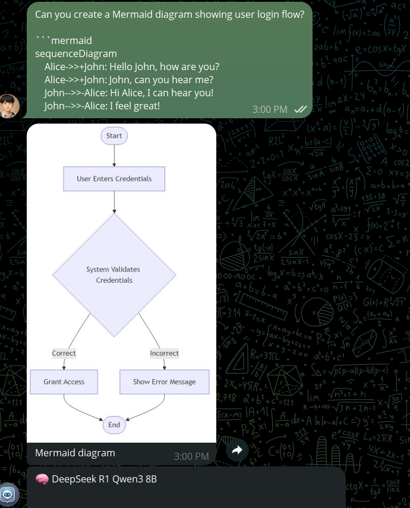

# 🤖 Telegram Gemini Bot

A powerful, multi-modal Telegram bot leveraging cutting-edge AI technologies including Google's Gemini 2.0 Flash, DeepSeek, OpenRouter, and 50+ AI models for comprehensive conversational assistance, media processing, and collaborative features.

<div align="center">
  
  
</div>

## 📑 Table of Contents
- [🤖 Telegram Gemini Bot](#-telegram-gemini-bot)
  - [📑 Table of Contents](#-table-of-contents)
  - [✨ Key Features](#-key-features)
  - [🔧 Prerequisites](#-prerequisites)
  - [🚀 Installation](#-installation)
  - [⚙️ Configuration](#️-configuration)
  - [💡 Usage](#-usage)
  - [📋 Commands](#-commands)
  - [🏗️ Project Structure](#️-project-structure)
  - [🐋 Docker Deployment](#-docker-deployment)
  - [🤝 Contributing](#-contributing)
  - [📄 License](#-license)

## ✨ Key Features

### 🧠 **AI & Language Models**
- **54+ AI Models**: Hierarchical model selection across Gemini, DeepSeek, OpenRouter (Llama, Claude, GPT, Qwen, Mistral, etc.)
- **Intelligent Model Switching**: Context-aware automatic model selection based on task type
- **Multi-Modal AI**: Combined text, image, document, and voice processing in single requests
- **Conversation Memory**: Persistent context across sessions with model-specific history
- **Smart Fallback System**: Automatic failover between AI providers for reliability
- **MCP Server Integration**: Connect AI models to external tools like Exa Search using Model Context Protocol

### 🎨 **Visual & Media Processing**
- **Mermaid Diagram Rendering**: Automatic detection and conversion of text-based diagrams to images
- **Image Generation**: Advanced image creation via Together AI and Imagen3 with custom prompts
- **Video Generation**: Text-to-video capabilities for creative content
- **Image Analysis**: Intelligent visual content analysis and description
- **Document Processing**: PDF, DOCX analysis with semantic search and content extraction

### 🎙️ **Voice & Speech**
- **Advanced Voice Recognition**: engines ( Faster-Whisper)
- **Voice Activity Detection**: Automatic silence filtering and speech enhancement
- **Confidence Scoring**: Reliability metrics for transcription accuracy

### 👥 **Group Chat & Collaboration**
- **Group Intelligence**: Shared memory and context across group conversations  
- **Collaborative Workspaces**: Team knowledge management and note sharing
- **Discussion Threading**: Structured conversations with topic tracking
- **Group Analytics**: Usage statistics and conversation insights
- **Role-Based Access**: Customizable permissions for different group members
- **Real-Time Collaboration**: Live typing indicators and activity streams

### 🔧 **Technical Excellence**
- **Production-Ready**: Optimized for high-traffic deployments with webhook support
- **Rate Limiting**: Intelligent request management and flood protection
- **Advanced Formatting**: Rich markdown with tables, spoilers, LaTeX, and code highlighting  
- **Smart Message Chunking**: Automatic splitting of long responses within Telegram limits
- **Error Recovery**: Comprehensive error handling with graceful degradation
- **Performance Monitoring**: Built-in logging, analytics, and debugging tools

## 🔧 Prerequisites
- **Python 3.11+** with asyncio support
- **Node.js 20.x+** for Mermaid diagram rendering
- **MongoDB** instance (local or MongoDB Atlas)
- **Required APIs**: 
  - Telegram Bot Token (via @BotFather)
  - Google Gemini API key
  - OpenRouter API key (optional, for 50+ additional models)
  - Together AI API key (for image/video generation)
  - HuggingFace API keys (for specialized models)
- **System Dependencies**: 
  - FFmpeg (for audio/video processing)
  - @mermaid-js/mermaid-cli (auto-installed in Docker)

## 🚀 Installation

### 🛠️ Development Setup
```bash
# Clone the repository
git clone https://github.com/Remy2404/Telegram-Gemini-Bot.git
cd Telegram-Gemini-Bot

# Create and activate Python virtual environment
python -m venv venv
source venv/bin/activate     # macOS/Linux  
venv\Scripts\activate        # Windows

# Install Python dependencies
uv sync
# or: pip install -r requirements.txt

# Install Node.js dependencies for Mermaid rendering
npm install -g @mermaid-js/mermaid-cli

# Verify installation
mmdc --version  # Should show Mermaid CLI version
```

### ⚡ Quick Start
```bash
# Start development server with hot reload
uv run uvicorn app:app --host 0.0.0.0 --port 8000 --reload

# Or start with production optimizations
uv run python app.py
```

## ⚙️ Configuration

Create a comprehensive `.env` file in the project root:

```env
# 🤖 Core Bot Configuration
TELEGRAM_BOT_TOKEN=your_telegram_bot_token
MONGODB_URI=mongodb://localhost:27017  # or MongoDB Atlas URI
MONGODB_DB_NAME=gembot

# 🧠 AI Model APIs
GEMINI_API_KEY=your_gemini_api_key
OPENROUTER_API_KEY=your_openrouter_api_key  # Access to 50+ models
DEEPSEEK_API_KEY=your_deepseek_api_key      # Optional, for DeepSeek models
TOGETHER_API_KEY=your_together_api_key      # For image/video generation
TEXT_TO_IMAGE_API_KEY=your_huggingface_api_key
TEXT_TO_VIDEO_API_KEY=your_huggingface_api_key

# 🌐 Server Configuration  
BOT_MODE=webhook                           # or 'polling'
WEBHOOK_URL=https://your-domain.com
PORT=8000
ENVIRONMENT=production                     # or 'development'
APP_VERSION=2.0.0
# 🔧 Advanced Settings
DEV_MODE=false
LOG_LEVEL=INFO
LOGS_DIR=logs

```

## 💡 Usage

### 🚀 Starting the Bot

#### Local Development
```bash
# Start with hot reload for development
uv run uvicorn app:app --host 0.0.0.0 --port 8000 --reload

# Start with production optimizations
uv run python app.py
```

#### Production Deployment
```bash
# Using Gunicorn with multiple workers
gunicorn app:app -w 4 -k uvicorn.workers.UvicornWorker --bind 0.0.0.0:8000

# Using Docker (recommended)
docker-compose up -d
```

### 🌟 Key Features in Action

#### 🎨 **Mermaid Diagram Generation**
Simply ask the bot to create diagrams:
```
👤 "Create a flowchart showing the user registration process"
🤖 [Automatically renders a beautiful diagram as an image]
```
- Supports all Mermaid diagram types: flowcharts, sequence, class, ER, Gantt, etc.
- Intelligent syntax cleaning and error handling
- Fallback to code display if rendering fails

#### 🧠 **Multi-Model AI Conversations**
```
👤 /switchmodel
🤖 Shows hierarchical model selection:
    📂 🧠 Gemini Models (3)
    📂 🔮 DeepSeek Models (5)  
    📂 🦙 Meta Llama Models (8)
    📂 🌟 Qwen Models (6)
    📂 ...and 40+ more models
```

#### 🏢 **Group Collaboration**
Add the bot to any group chat:
```
/groupsettings - Configure collaboration features
/groupcontext - View shared group memory
/groupthreads - Manage discussion topics
/groupstats - Group usage analytics
```

#### 📄 **Document Processing**
Upload any PDF or DOCX file:
- Intelligent content extraction and analysis
- Semantic search within documents
- AI-powered summarization and Q&A
- Export conversations to formatted documents
### 🎯 **Specialized Use Cases**

#### For Developers
```bash
👤 "Explain this Python code and suggest improvements"
🤖 [Provides detailed code analysis with suggestions]

👤 "Create a class diagram for a user authentication system"  
🤖 [Generates professional UML diagram]
```

#### For Content Creators
```bash
👤 /genimg "A futuristic city at sunset with flying cars"
🤖 [Creates high-quality AI-generated image]

#### For Teams and Groups
```bash
👤 "Summarize our last discussion about the project timeline"
🤖 [Provides intelligent summary of group conversations]

👤 /groupthreads
🤖 [Shows organized discussion topics and threads]
```

#### For Document Export & Creation
```bash
👤 /exportdoc
🤖 Choose what to export:
    📜 Export Conversation
    ✏️ Provide Custom Text
    
👤 [Send custom text like "# My Report\n\nThis is my **important** document"]
🤖 [Converts to professional PDF/DOCX with proper formatting]

👤 /gendoc
🤖 [AI generates complete documents based on your requirements]
```

## 📋 Commands

| Command           | Description                          | Usage Example |
|-------------------|--------------------------------------|---------------|
| `/start`          | Initialize the bot and get welcome   | `/start` |
| `/help`           | List all available commands          | `/help` |
| `/genimg`         | Generate an image from text prompt   | `/genimg sunset over mountains` |
| `/imagen3`        | Advanced image generation (Imagen3)  | `/imagen3 futuristic city` |
| `/generate_video` | Create a video from text prompt      | `/generate_video dancing robot` |
| `/reset`          | Clear conversation history           | `/reset` |
| `/stats`          | Show usage statistics                | `/stats` |
| `/preferences`    | Configure user preferences           | `/preferences` |
| `/settings`       | Access bot settings                  | `/settings` |
| `/switchmodel`    | Hierarchical AI model selection      | `/switchmodel` |
| `/listmodels`     | List all available AI models         | `/listmodels` |
| `/currentmodel`   | Show current AI model                | `/currentmodel` |
| `/exportdoc`      | Export chat to PDF/DOCX              | `/exportdoc` |
| `/gendoc`         | Generate AI-powered documents        | `/gendoc` |

### 👥 **Group Chat Commands**
| Command           | Description                          | Usage Example |
|-------------------|--------------------------------------|---------------|
| `/groupstats`     | Show group usage statistics          | `/groupstats` |
| `/groupsettings`  | Configure group settings             | `/groupsettings` |
| `/groupcontext`   | View shared group memory            | `/groupcontext` |
| `/groupthreads`   | Manage discussion topics            | `/groupthreads` |
| `/cleanthreads`   | Clean up inactive conversation threads | `/cleanthreads` |

### 🌟 **Special Features**
- **🎨 Automatic Mermaid Rendering**: Just ask for diagrams and they'll be rendered as images
- **🎙️ Voice Messages**: Send voice notes for transcription and response
- **📁 File Upload**: Drag and drop PDFs, images, videos for AI analysis
- **💬 Group Chat**: Add bot to groups with @mention support
- **🔄 Model Memory**: Each AI model maintains separate conversation history
- **📄 Rich Export**: Export conversations with formatting, images, and metadata

## Project Structure
```
src/
├── database/        # Database schemas and connections
├── handlers/        # Message & callback handlers
├── services/        # AI model wrappers & business logic
├── utils/           # Logging, config, utilities
└── main.py          # Entry point
app.py               # FastAPI server setup
```

## Docker Deployment
Build and run:
```bash
docker build -t telegram-gemini-bot .
docker run -d -p 8000:8000 --env-file .env telegram-gemini-bot
```
With Docker Compose:
```bash
docker-compose up -d
```

## Contributing
Contributions are welcome. Fork the repo, create a feature branch, commit your changes, and open a pull request.

## License
This project is licensed under the MIT License. See [LICENSE](LICENSE) for details.
